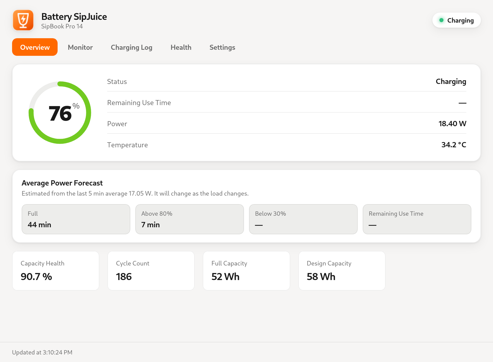
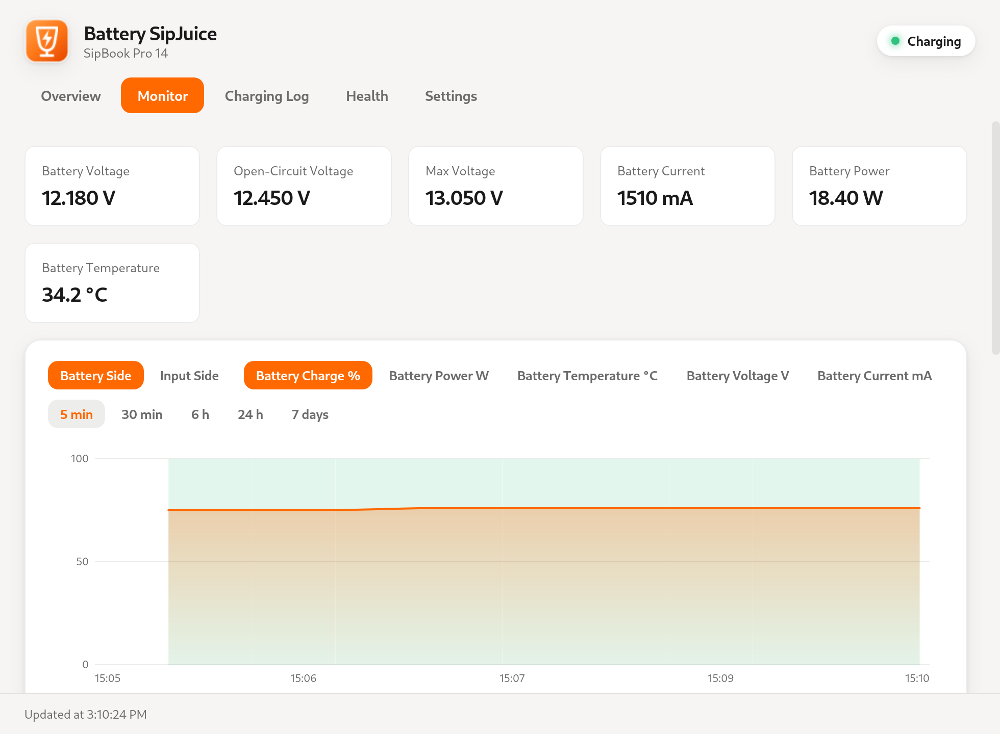
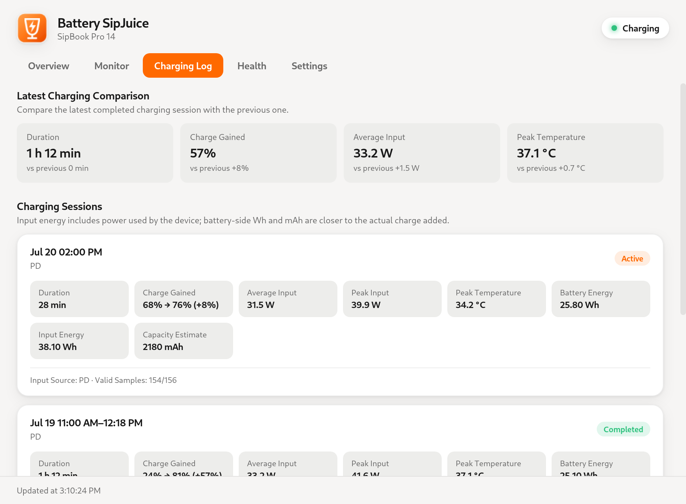
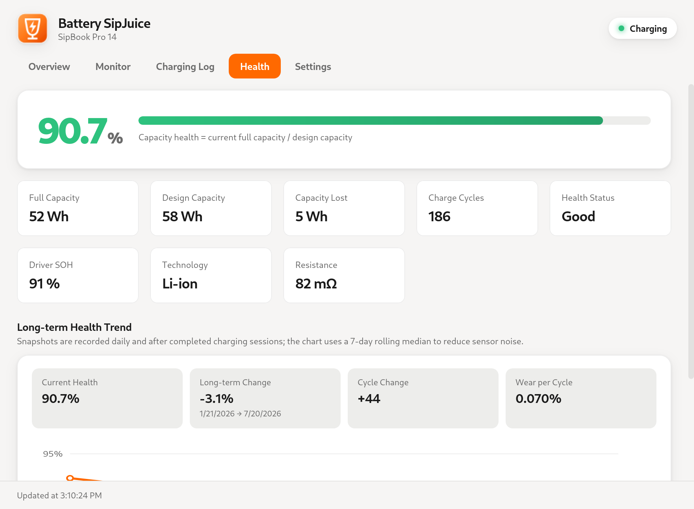

<p align="center">
  
</p>

<h1 align="center">Battery SipJuice</h1>

<p align="center">
  A local-first battery monitor and care utility for Linux laptops and tablets.
</p>

<p align="center">
  <strong>English</strong> · <a href="README.zh-CN.md">简体中文</a>
</p>

<p align="center">
  <a href="https://github.com/EmberLuo/battery_sipjuice/actions/workflows/linux-x64-packages.yml"></a>
  
  
  <a href="LICENSE"></a>
</p>

## Screenshots

<p align="center"><sub>Rendered from the current source tree with isolated demo data.</sub></p>

<p align="center">
  
</p>

<table>
  <tr>
    <td></td>
    <td></td>
  </tr>
  <tr>
    <td align="center">Monitoring history</td>
    <td align="center">Charging sessions</td>
  </tr>
</table>

<p align="center">
  
</p>

## About

Battery SipJuice is a Linux-only desktop utility for understanding battery condition, charging behavior, and power usage over time. It reads standard and vendor-provided data from Linux `power_supply` and `procfs`, then presents it through a lightweight Tauri interface.

All monitoring data stays on the local machine. Battery SipJuice does not require an account, upload telemetry, or modify firmware charging policies.

> Available metrics depend on the Linux kernel, firmware, and drivers exposed by each device. Missing hardware readings are shown as unavailable instead of being guessed.

## Features

- **Live battery monitoring** — charge level, status, remaining time, power, voltage, current, and temperature.
- **Multi-battery support** — inspect each installed battery with independent history and health records.
- **Seven-day history** — fixed-size, multi-resolution charts for battery and input power data without unbounded storage growth.
- **Charging sessions** — automatically records charge range, duration, Wh/mAh estimates, power, temperature, and input-source metadata.
- **Long-term health trends** — daily and post-session snapshots with a smoothed capacity-health curve and wear-per-cycle estimate.
- **Power-source monitoring** — displays USB-C, mains, and wireless inputs exposed through Linux `power_supply`.
- **Per-application power estimates** — attributes battery discharge power using process CPU-time share; useful for comparison, not hardware-accurate metering.
- **Battery care reminders** — configurable notifications for low/high charge, high/low temperature, and sustained abnormal drain.
- **Linux desktop integration** — system tray, launch at login, silent start, single-instance behavior, and configurable close actions.
- **Personalized interface** — Chinese and English languages, light/dark/system themes, and selectable or system accent colors.

## Build from Source

### Requirements

- Linux with WebKitGTK 4.1
- [Rust](https://rustup.rs/)
- Node.js and npm

On Debian or Ubuntu, install the native build dependencies with:

```bash
sudo apt update
sudo apt install -y \
  build-essential curl file libayatana-appindicator3-dev \
  libjavascriptcoregtk-4.1-dev librsvg2-dev libsoup-3.0-dev \
  libssl-dev libwebkit2gtk-4.1-dev libxdo-dev patchelf rpm wget
```

### Develop

```bash
git clone https://github.com/EmberLuo/battery_sipjuice.git
cd battery_sipjuice
npm install
npm run dev
```

### Package

```bash
npm run build
```

The default build produces the bundle targets configured in Tauri (`.deb` and AppImage). Additional package commands are available:

| Command | Output |
| --- | --- |
| `npm run build:deb` | Debian package |
| `npm run build:rpm` | RPM package |
| `npm run build:linux:packages` | Debian and RPM packages |
| `npm run build:linux:x64` | x86_64 Debian and RPM packages |

Build artifacts are normally written under `src-tauri/target/release/bundle/`; explicitly targeted builds use `src-tauri/target/<target-triple>/release/bundle/`. Packaging commands regenerate all application PNG icons from `src/app-icon.svg` before compiling.

## License

Battery SipJuice is released under the [Apache License 2.0](LICENSE). Redistributions must preserve the license, applicable copyright and attribution notices, and the project [NOTICE](NOTICE) as required by the license.
